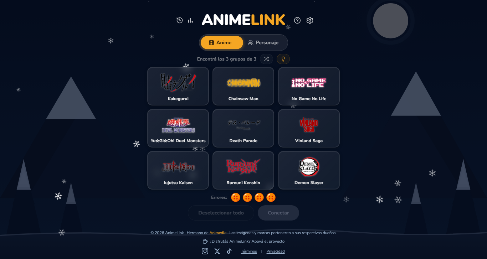

# Portafolio - Matias Sesto



Portafolio personal de **Matias Sesto**, desarrollador Full Stack. SPA construida con **React + Vite**, con tema claro/oscuro, interfaz bilingüe (español/inglés con detección automática por región), galería de proyectos con carrusel y modales, y certificados descargables.

---

## ✨ Características

- **Tema oscuro / claro** con persistencia en `localStorage` y detección de la preferencia del sistema.
- **Bilingüe (ES / EN)** — detecta automáticamente el idioma según la región del navegador (si empieza por `es` → español, sino inglés) y permite cambiarlo con un toggle persistente.
- **Landing (Home)** con perfil, descripción y CTA para descargar el CV.
- **Sobre mí** con distribución por tarjetas: perfil, valores, datos personales, skills agrupadas por categoría, educación, experiencia y cursos certificados.
- **Proyectos** con miniaturas, chips de tecnologías, botón de **demo en vivo** y **modal** con galería/carrusel, video y stack. Los mejores proyectos aparecen primero.
- **Certificados clickeables** — cada curso abre un modal para ver o descargar el certificado (PDF) al agregar el archivo.
- **Contacto** con tarjetas de email, LinkedIn y GitHub.
- **Accesible**: `aria-label`, focus visible, `prefers-reduced-motion`, botones con estados de hover/focus.
- **Iconos** con `lucide-react` (UI) y `react-icons` (marcas: GitHub/LinkedIn).

---

## 🛠 Stack

| Capa | Tecnologías |
|------|-------------|
| **Frontend** | React 18, Vite 5, React Router 7 |
| **Hosting** | Estático (build de Vite, `dist/`) |
| **Iconos** | lucide-react, react-icons |

---

## 📁 Estructura

```
client/
├── index.html              # entry, SEO meta, scripts anti-flash (tema e idioma)
├── public/
│   ├── projects.json       # datos de los proyectos (título, skills, links, screenshots)
│   ├── img/
│   │   ├── screens/        # capturas de cada proyecto
│   │   ├── skills/         # logos de tecnologías
│   │   └── ...             # avatar, iconos, etc.
│   └── pdf/
│       ├── certs/          # certificados de cursos (PDF descargables)
│       └── Curriculum Vitae - Matias Sesto.pdf
└── src/
    ├── App.jsx             # rutas, ScrollToTop, footer, idioma
    ├── i18n.js             # textos EN/ES + detección de idioma
    ├── i18n/               # LanguageProvider + useLanguage (contexto de idioma)
    ├── hooks/useTheme.js   # tema claro/oscuro
    ├── components/         # Navbar, Caroussel, ProjectModal, CertificateModal
    └── pages/              # Home, About, Projects, Contact
```

---

## 🚀 Puesta en marcha

Requisitos: **Node.js 18+** y `npm`.

```bash
cd client
npm install
npm run dev      # servidor de desarrollo (http://localhost:5173)
npm run build    # build de producción → dist/
npm run preview  # sirve el build de producción localmente
npm run lint     # eslint
```

> El build queda en `client/dist/` (git-ignored). El deploy se hace sirviendo esa carpeta en cualquier hosting estático.

---

## 🧩 Cómo agregar un proyecto

Los proyectos se renderizan desde **`public/projects.json`**. Agregá una entrada con:

```json
{
  "id": 10,
  "name": "Mi Proyecto",
  "skills": ["React", "Node.js"],
  "description": "Breve descripción (se traduce automáticamente si está en el i18n).",
  "repository": "https://github.com/usuario/repo",
  "url": "https://demo.miproducto.com",
  "video": "",
  "images": ["/img/screens/mi-proyecto-screens/screen1.png"]
}
```

- **`url`** (opcional): muestra el botón de **demo en vivo**.
- **`video`** (opcional): reproductor de YouTube embed en el modal.
- **`images`**: capturas para el carrusel del modal. Si falta, se muestra una miniatura con la inicial.
- Para ordenar los mejores primero, reacomodá el orden de las entradas en el JSON.

---

## 📜 Cómo agregar certificados

Los cursos se muestran como tarjetas clickeables. Para que al abrirlas se vea/descargue el certificado:

1. Creá la carpeta `client/public/pdf/certs/` (ya existe con `.gitkeep`).
2. Agregá el PDF con el nombre esperado (definido en `src/i18n.js`, por ejemplo `fullstack-web-dev-jr.pdf`).
3. Si el archivo no existe, el modal muestra "Certificado en camino" con la ruta esperada.

---

## 🌐 Idiomas (i18n)

- El idioma se detecta al cargar: primero el guardado en `localStorage`, luego `navigator.language` (`es*` → español, resto → inglés).
- El toggle de la navbar cambia entre ES/EN y persiste la elección.
- Todos los textos de la interfaz viven en **`src/i18n.js`** (claves `en` / `es`), incluidas las descripciones de proyectos por nombre.

---

## 📦 Deploy

Sirviendo `client/dist/` en cualquier hosting estático (Vercel, Netlify, GitHub Pages, etc.) ya es suficiente. También podés configurar el build desde un repo:

```bash
# en el hosting
npm run build
# servir client/dist/
```

---

## 🙋 Sobre el autor

**Matias Sesto** — Desarrollador Full Stack.
- GitHub: [@Matiasjs1](https://github.com/Matiasjs1)
- LinkedIn: [in/matias-sesto](https://www.linkedin.com/in/matias-sesto-b5aa8b33a)
- Email: [matiasjsesto@gmail.com](mailto:matiasjsesto@gmail.com)
